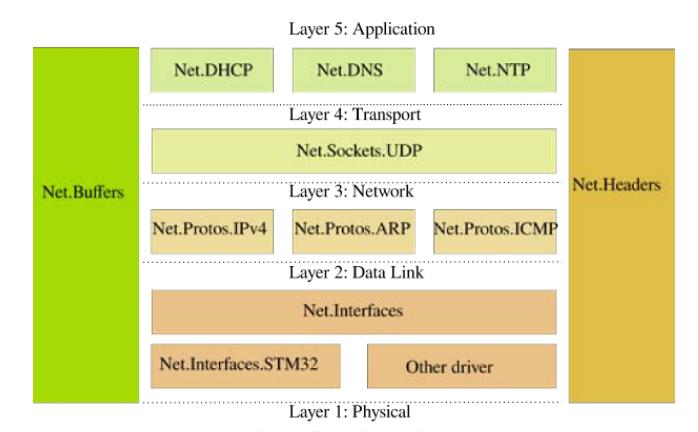
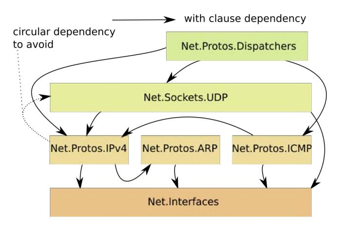
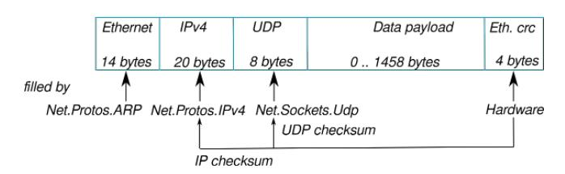
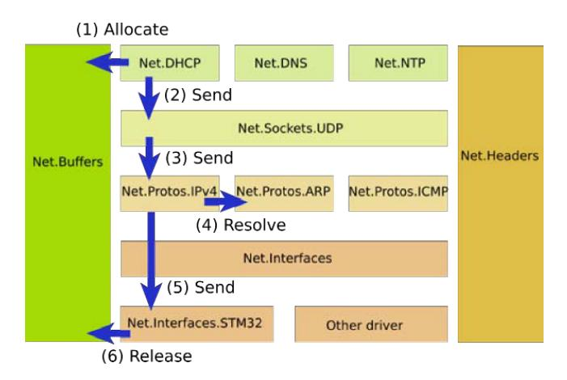
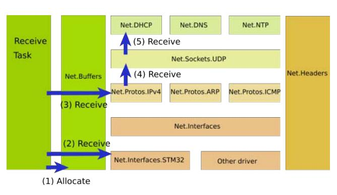
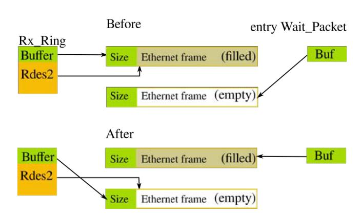
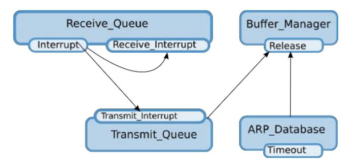

# Мережевий стек IP в Ada 2012 та профіль Ravenscar

> *Стефан Каррез*
>
> Іссі-ле-Муліно, Франція
>
> Переклад статті з Ada User Journal, Volume 38, N4 2017

## Анотація

*У цій статті представлено Ada Embedded Network, невеликий мережевий
стек, призначений для використання в невеликих вбудованих додатках Ada,
що працюють на ARM. Він реалізує стандартні протоколи ARP, IPv4, UDP,
DNS і DHCP на базі драйвера Ethernet. Його енергоефективна конструкція
дозволяє йому працювати на платі STM32F746.*

*У статті представлено компоненти з точки зору реалізації Ada. У ній
висвітлено особливості Ada, які були використані, та показано деякі
переваги профілю Ravenscar, які допомогли в реалізації проекту.*

*Ключові слова: Ethernet, IPv4, мережі, протоколи, Ravenscar.*

## Вступ

Проект Ada Embedded Network \[1\] --- це проект з відкритим кодом, який
був створений в рамках конкурсу EtherScope MakeWith-Ada 2016. Метою було
отримати надійний, безпечний і захищений мережевий стек для вбудованих
додатків IoT.

Мережевий стек був розроблений з урахуванням декількох цілей. По-перше,
метою було використання мови Ada 2012 з низкою нових функцій, таких як
попередні та наступні умови, щоб зробити мережевий стек надійним. Іншою
метою проектування було визначення архітектури, яка дозволяє уникнути
копіювання пам\'яті під час надсилання та отримання пакетів. Де це було
можливо, було вирішено використовувати асинхронні операції для
надсилання та отримання мережевих пакетів. Щоб архітектура залишалася
простою та придатною для повторного використання, завдання виконуються
на рівні додатків.

Цільовою платою була плата STM32F746 ARM з найменшим доступним часом
виконання Ada, але з можливістю використання завдань. Щоб забезпечити
невеликий обсяг пам\'яті, не використовуються винятки, тому ми можемо
використовувати профіль Ravenscar sfp, визначений бібліотекою драйверів
Ada \[2\]. Це дозволяє вбудованій мережі Ada мати розумний обсяг
пам\'яті, який не перевищує 50 Кб.

### Огляд

Ця стаття має таку структуру. У розділі 2 представлено архітектуру, яка
потім використовується в розділі 3 на прикладі невеликого сервера
відлуння. У розділі 4 представлено виклики, з якими зіткнулися в ході
проекту, а в розділі 5 наведено висновки.

## Архітектура

Мережевий стек складається з декількох рівнів, які обробляють конкретні
протоколи. Референтна модель OSI \[3\] зображує різні рівні та їхні
ролі.

Пакет Ada надає важливу функцію для налаштування та організації
архітектури мережевого стека. Пакет Ada дозволяє забезпечити
представлення та організацію, близькі до моделі OSI та доступних і
підтримуваних мережевих протоколів.



Рисунок 1: Архітектура та пакети Ada

Використовувані всіма стеками мережевих протоколів, пакети Net.Buffers
та Net.Headers надають глобальні типи даних та абстракції для
представлення мережевого пакета або заголовка протоколу повідомлення. У
нижній частині мережевого стека пакети Net.Interfaces та
Net.Interfaces.STM32 відповідають рівню передачі даних моделі OSI,
відповідальному за відправлення та отримання необроблених пакетів. Над
ним (транспортний рівень у моделі OSI) розташований пакет
Net.Protos.IPv4, який обробляє протокол IPv4 \[4\], пакет
Net.Protos.ICMP, який обробляє протокол ICMP \[5\], та пакет
Net.Protos.ARP \[6\], відповідальний за перетворення адреси IPv4 в
Ethernet.

На вершині знаходиться прикладний рівень моделі OSI, який забезпечує
протоколи Net.DHCP, Net.DNS та Net.NTP. Ці три протоколи реалізовані на
рівні протоколу UDP. Протокол DHCP \[7\] використовується для отримання
конфігурації мережі IPv4, включаючи адресу IPv4, шлюз за замовчуванням
та адресу DNS-сервера. Протокол DNS \[8\] використовується для
перетворення імені в IPv4 або IPv6.
Нарешті, протокол NTP \[9\] використовується для отримання часу
GMT і синхронізації системного годинника з серверами NTP.

Обмеження залежності пакета Ada було викликом для реалізації мережевого
стека. Дуже скоро виникають залежності між різними протоколами. Пакет
IPv4 реалізує операції відправлення та отримання IP-пакетів. Зокрема,
він забезпечує операції заповнення та побудови IP-заголовка в пакетах.
Рівень IPv4 також відповідає за обробку прийому пакетів та їх
відправлення до верхнього рівня, такого як UDP.



Рисунок 2: Залежності пакетів Ada

Циклічна залежність була вирішена шляхом введення пакета
Net.Protos.Dispatchers, який забезпечує прийом пакетів і обробку їх
відправки до протоколів верхнього рівня.

### Мережеві буфери

Перш ніж розглянути, як працює мережевий стек і що відбувається, коли ми
надсилаємо або отримуємо пакет, важливо зрозуміти, як представлені та
контролюються мережеві буфери.

Мережевий буфер використовується додатками для підготовки даних до
відправлення або отримання. Потім мережевий стек повинен додати деякі
заголовки протоколу, а драйвер Ethernet низького рівня повинен помістити
пакет в апаратне кільце для передачі. Однією з наших цілей є уникнення
копіювання пам\'яті під час відправлення та отримання пакетів, оскільки
копіювання даних уповільнює роботу мережевого стека. Пам\'ять також є
дефіцитним ресурсом у вбудованих системах, і управління буфером є
ключовим для досягнення хорошої продуктивності.

Пакет Net.Buffers забезпечує підтримку управління мережевими буферами.
Мережевий буфер може вмістити один кадр пакета, тому він обмежений 1500
байтами корисного навантаження з 14 або 18 байтами для заголовка
Ethernet. Як показано на рисунку 3, пакет має кілька частин, які
контролюються різними рівнями моделі OSI. Для пакета UDP програма може
заповнити до 1458 байтів даних. Протоколи Ethernet, IP та UDP визначають
кілька контрольних сум. Усі вони контролюються апаратним забезпеченням
за допомогою мікросхеми STM32F746.



Рисунок 3: Структура пакета Ethernet

Пакет визначає два важливі типи: Buffer_Type і Buffer_List. Ці два типи
є обмеженими типами, щоб заборонити копіювання і змусити додатки
дотримуватися суворого дизайну. Buffer_Type описує кадр пакета і надає
різні операції для доступу до буфера. Buffer_List визначає список
буферів.

Мережеві буфери зберігаються в єдиному зв\'язаному списку, який
управляється захищеним об\'єктом. Захищені операції з виділення та
звільнення буферів мають складність O(1), оскільки зв\'язані списки
використовуються як черги.

Додаток виділяє буфер за допомогою операції Allocate наступним чином:

```ada
declare
   Packet : Net.Buffers.Buffer_Type;
...
begin
   Net.Buffers.Allocate (Packet);

   if Packet.Is_Null then
      null; -- Неуспішне виділення
   end if;
```

Додатки повинні перевіряти, чи буфер був успішно виділений, оскільки у
разі відсутності доступного буфера виняток не генерується. Ви повинні
перевірити, чи виділення було успішним, використовуючи функцію Is_Null.

Перед отриманням пакета програма повинна виділити мережевий буфер. Після
успішного отримання пакета процедурою Receive виділений мережевий буфер
буде переданий в чергу прийому Ethernet, а програма отримає назад
отриманий буфер. Копіювання пам\'яті не відбувається.

Щоб надіслати пакет, програма спочатку виділяє буфер, заповнює корисне
навантаження даними та передає пакет до мережевого стека. Мережевий стек
заповнює різні заголовки, специфічні для протоколу, та поміщає пакет до
черги передачі. Коли це відбувається, програма втрачає право власності
на буфер пакета. Ця передача права власності виражається в пост-умові
щодо операції драйвера інтерфейсу, яка вказує, що буфер стає порожнім.

```
procedure Send (Ifnet : in out Ifnet_Type;
                Buf : in out Buffer_Type) is abstract
   with Pre'Class => not Buf.Is_Null,
        Post'Class => Buf.Is_Null;
```

### Відправлення пакета

Розглянемо, що відбувається, коли ми відправляємо простий пакет. На
рисунку 4 показано потік виконання, який проходить пакет UDP через різні
пакети Ada.

Буфер мережевого пакета спочатку виділяється на рівні прикладного шару.
Прикладне програмне забезпечення заповнює пакет даними, які потрібно
надіслати. Потім викликається процедура Send у каскаді



Рисунок 4: Відправлення пакета

через різні рівні для надсилання даних. Рівень UDP заповнює заголовок
UDP пакета, а рівень IP обробляє заголовок IP. Перед надсиланням пакета
на рівень інтерфейсу необхідно перетворити адресу призначення IPv4 в
адресу Ethernet. Це здійснюється за допомогою протоколу ARP \[6\].
Процедура Resolve займається цим перетворенням, спочатку перевіряючи
деякі таблиці бази даних ARP або виконуючи перетворення ARP, коли адреса
IPv4 невідома. У цьому випадку пакет додається до черги до тих пір, поки
не буде отримано відповідь ARP або не відбудеться тайм-аут.

Як тільки IPv4-адреса перетворюється на Ethernet-адресу, пакет
надсилається до драйвера Ethernet, який поміщає пакет у чергу
відправлення. Після надсилання пакета буфер звільняється і повертається
до вільної черги управління буфером.

### Отримання пакета

Оскільки прийом пакета є блокуючою операцією, для обробки прийому пакета
необхідне завдання, і ця робота повинна виконуватися додатком. Дійсно,
при проектуванні та реалізації вбудованої мережі Ada було прийнято
рішення уникнути нав\'язування моделі завдань для обробки прийому
мережевих пакетів і замість цього залишити це додатку. Це дозволяє
додатку вибирати різні стратегії для обробки прийому мережевих пакетів.
Наприклад, програма може вирішити призначити пакет різним завданням
залежно від типу пакета.



Рисунок 5: Отримання пакета

Завдання прийому повинно виділити мережевий буфер, а потім викликати
процедуру прийому драйвера інтерфейсу Ethernet, щоб очікувати пакет. Ця
операція повернеться тільки після отримання пакета. Після отримання
пакета завдання прийому повинно викликати мережевий стек з пакетом, щоб
пакет був оброблений відповідними верхніми рівнями.

Пакет спочатку відправляється відповідно до типу пакета Ethernet, а
потім відповідно до заголовка протоколу IP. Наприклад, якщо тип пакета
Ethernet --- 16#806#, він відповідає протоколу ARP, і пакет
відправляється на рівень Net.Protos.ARP. Якщо тип пакета Ethernet ---
16#800#, це означає, що пакет призначений для рівня IPv4 і обробляється
Net.Protos.IPv4.

Рівень IPv4 відправляє пакети на вищі рівні відповідно до заголовка
протоколу IP. Рівень UDP відправляє пакети відповідно до порту UDP
призначення аж до програми.

### Обслуговування мережевого стека

Деякі мережеві протоколи потребують управління для обробки тайм-аутів
або повторних передач. Для вирішення ARP іноді необхідна повторна
передача, а база даних ARP повинна періодично очищатися для видалення
старих записів. Зі свого боку, протокол DHCP повинен управляти повторною
передачею запитів, а також враховувати поновлення та закінчення терміну
оренди. Додаток може використовувати спеціальне завдання для обробки
цього, мати завдання для кожного протоколу або інтегрувати управління
мережею в існуючий цикл. Більшість таймерів працюють в секундах або
хвилинах і не потребують обмежень у реальному часі. Оскільки профіль
Ravenscar застосовує прагму No_Relative_Delay, всі тайм-аути протоколу
представлені та управляються за допомогою кінцевих термінів. Їх можна
безпечно викликати до настання кінцевого терміну. Якщо їх викликати
занадто пізно, вони все одно оброблять тайм-аут. Можливий основний цикл
може бути таким:

```ada
with Ada.Synchronous_Task_Control;
use Ada.Synchronous_Task_Control;

...
Ready : Suspension_Object;

task body Housekeeping is
   Deadline : Ada.Real_Time.Time;
begin
   Suspend_Until_True (Ready);

   loop
      Net.Protos.Arp.Timeout (Ifnet);
      Dhcp.Process (Deadline);
      delay until Deadline;
   end loop;
end Houstkeeping;
```

У профілі Ravenscar завдання оголошуються і створюються статично, вони
запускаються негайно. Ось чому для очікування повної ініціалізації
мережевого стека використовується об\'єкт призупинення.

### Проектування драйвера Ethernet

Драйвер Ethernet є цікавим компонентом для вивчення з точки зору Ada.
Апаратне забезпечення Ethernet має черги прийому та передачі,
організовані у вигляді кільця. Кільце прийому ініціалізується на початку
і містить ряд мережевих буферів, готових до використання апаратним
забезпеченням. Коли пакет приймається, апаратне забезпечення
використовує вільний буфер входу в кільце, заповнює буфер даними пакета
і позначає запис прапорцями, що вказують на наявність даних. Кільце
передачі

також ініціалізується на початку, але не містить жодного буфера, доки не
з\'являється пакет для відправлення.

Профіль Ravenscar дозволяє оголосити не більше одного запису в
захищеному об\'єкті або захищеному типі. Оскільки нам потрібен один
запис для очікування пакета, що надходить, і інший запис для
відправлення пакета, ми оголосимо і будемо використовувати два захищені
об\'єкти. Обмеження профілю Ravenscar насправді є для нас корисним,
оскільки змушує проектувати і реалізовувати окреме управління передачею
і прийомом. Це також хороший дизайн для максимізації паралельності між
передачею і прийомом.

```ada
protected Transmit_Queue
   with Priority => Net.Network_Priority is

   entry Send (Buf : in out Buffer_Type);

   procedure Transmit_Interrupt;

   procedure Initialize ;

   function Is_Ready return Boolean;

private
   ...
end Transmit_Queue;

protected Receive_Queue
   with Interrupt_Priority => Net.Network_Priority is

   entry Wait_Packet (Buf : in out Buffer_Type);

   procedure Initialize (List : in out Buffer_List);

   procedure Receive_Interrupt;

   procedure Interrupt
     with
       Attach_Handler => Ada.Interrupts.Names.ETH_Interrupt,
       Unreferenced;

   function Is_Ready return Boolean;

private
   ...
end Receive_Queue;
```

Кільця прийому та передачі є спільними для драйвера Ethernet (наш пакет
Ada) та апаратного забезпечення. Крім того, ми використовуємо
переривання для отримання повідомлень про виникнення певних апаратних
подій. Такі переривання виникають під час прийому пакета, надсилання
пакета або інших апаратних подій.

Кільце прийому Ethernet представлене записом Rx_Ring, а кільце передачі
--- записом Tx_Ring. Кожне з них містить об\'єкт Buffer_Type, який
представляє буфер пакетів, пов\'язаний з дескриптором кільця. Сам
апаратний дескриптор вказує на початок буфера даних, що представляє кадр
Ethernet. Коли пакет отримано, контролер Ethernet заповнює кадр Ethernet
і встановлює в апаратному дескрипторі таку інформацію, як розмір
отриманого пакета та інші прапорці дійсності.

```ada
type Tx_Ring is limited record
  Buffer : Net.Buffers.Buffer_Type;
  Desc   : Eth.Tx_Desc_Type;
end record;

type Rx_Ring is limited record
  Buffer : Net.Buffers.Buffer_Type;
  Desc   : Eth.Rx_Desc_Type;
end record;
```

В операції Wait_Packet ми уникаємо копіювання пам\'яті, перемикаючи
буфер між буфером програми та буфером кільця прийому Ethernet. Таким
чином, кільце прийому Ethernet завжди містить дійсний буфер, і ми
уникнули копіювання.



Рисунок 6: Перемикання буфера в операції прийому

## Написання Echo сервера

Простий сервер відлуння, представлений тут, відповідає протоколу Echo
\[10\]. Коли клієнт надсилає повідомлення UDP на сервер відлуння, сервер
відповідає тим самим повідомленням UDP. Це, мабуть, один з найпростіших
серверів, який ми можемо реалізувати, і він також корисний для перевірки
мережевого з\'єднання між клієнтом і сервером. У реальному житті цей
протокол не слід активувати на сервері через проблеми безпеки.

Щоб визначити наш сервер, ми маємо використовувати тег
Net.Sockets.Udp.Socket як розширення типу сервера відлуння, а потім
перезаписати процедуру Receive. Ми бачили, що процедура Receive
викликається мережевим стеком, коли пакет доступний для сокета UDP. Ми
отримаємо наше повідомлення відлуння, надіслане клієнтом, і просто маємо
надіслати його йому назад.

Повна специфікація пакета сервера відлуння є такою:

```ada
with Net.Sockets.Udp;
with Net.Buffers;

package Echo_Server is

  type Echo_Server is
     new Net.Sockets.Udp.Socket with null record;

  overriding procedure Receive
     (Endpoint : in out Echo_Server;
      From     : in Net.Sockets.Sockaddr_In;
      Packet   : in out Net.Buffers.Buffer_Type);

  Server : aliased Echo_Server;

end Echo_Server;
```

Коли викликається процедура Receive, вона отримує як параметр пакет, що
був отриманий, а також мережеву адресу сокета відправника. Можна
отримати розмір корисного навантаження пакета за допомогою функції
Get_Data_Size. Ми можемо використовувати процедуру Get_String, щоб
витягти з корисного навантаження рядок потрібного розміру.

Інстанція нашого сервера оголошується і повинна бути зареєстрована в
мережевому стеку. Ця операція, відома як прив\'язка сокета до порту в
традиційних системах Unix, виконується процедурою Bind, що надається
типом Socket. Процедура Bind потребує доступу до інстанції мережевого
інтерфейсу,
а також до порту UDP і опціональної IP-адреси для прив\'язки. Мережевий
стек збереже тип доступу до екземпляра сервера і буде використовувати
його при отриманні пакета UDP на порт призначення 7, як зазначено в
протоколі echo. Мережеві стеки покладаються на цілі числа, що
представлені в мережевому порядку байтів, який традиційно є big endian.
Отже, значення номера порту перетворюється за допомогою функції
To_Network.

```ada
Echo_Server.Server.Bind
   ( Ifnet => Ifnet'Access,
   Addr => (Port => Net.Headers.To_Network (7),
            Addr => (others => 0)));
```

Коли мережевий стек отримує пакет UDP, він переглядає список сокетів,
щоб знайти відповідний порт UDP, у нашому випадку порт 7. Коли такий
екземпляр знайдено, викликається відповідна процедура Receive.

```ada
package body Echo_Server is
   ...

  overriding procedure Receive
     (Endpoint : in out Echo_Server;
      From : in Net.Sockets.Sockaddr_In;
      Packet : in out Net.Buffers.Buffer_Type) is

     Size : constant Net.Uint16 :=
       Packet.Get_Data_Size (Net.Buffers.UDP_PACKET);

     Status : Net.Error_Code;
  begin
     Packet.Set_Data_Size (Size);
     Endpoint.Send
       (To => From, Packet => Packet, Status => Status);
  end Receive;

end Echo_Server;
```

Ехо-сервер повинен відправити назад оригінальний пакет. Для цього наша
частина корисного навантаження пакета вже містить правильний вміст, і
нам залишається тільки встановити розмір пакета перед відправкою даних.
Пакет відправляється назад відправнику, тому ми передаємо процедурі Send
адресу відправника в її параметрі To.

Після завершення процедури Send дані пакета передаються без копіювання
до драйвера Ethernet.

## Виявлені труднощі та їх вирішення

У цьому розділі представлено кілька труднощів, виявлених під час
реалізації проекту, та наведено рішення, які були використані для їх
усунення.

### Відсутність випадкових чисел

Випадкові числа використовуються мережевими протоколами для генерації
криптографічних ключів для шифрування даних, що надсилаються мережами.
Але вони також використовуються декількома незахищеними протоколами для
зменшення обсягу та ускладнення атак. Це стосується протоколу DNS, який
використовує ідентифікатори транзакцій (TXID) для відстеження запитів та
відповідей на них. Ідентифікатор транзакції DNS --- це 16-бітне ціле
число в пакеті запиту, яке використовується разом із портом джерела UDP
для ідентифікації відповіді DNS. Зловмисник може підробити відповідь DNS
із відповідним ідентифікатором транзакції та портом джерела UDP, щоб
обдурити DNS-сервер. Використовуючи випадкове число для ідентифікатора
транзакції DNS та

UDP-порту ми ускладнюємо підробку, оскільки зловмисник повинен вгадати
32-бітне значення.

Профіль Ravenscar sfp у компіляторі GNAT не надає загальний пакет
Ada.Numerics.Discrete_Random, але, на щастя, плата STM32F746 має
апаратний генератор випадкових чисел, який можна використовувати. Нашу
операцію з випадковими числами можна реалізувати таким чином:

```ada
with STM32.RNG.Interrupts;

procedure Initialize is
begin
   STM32.RNG.Interrupts.Initialize_RNG;
end Initialize ;

function Random return Uint32 is
begin
   return STM32.RNG.Interrupts.Random;
end Random;
```

На жаль, ця проста операція мала несподівану поведінку: в деяких
ситуаціях вона викликала виняток Program_Error. Причина та рішення
пояснюються в наступному розділі.

### Обмеження Detect_Blocking

Профіль Ravenscar активує прагму Detect_Blocking, яка змушує виявляти
потенційно блокуючі операції в межах захищеної операції. Таке виявлення
здійснюється середовищем виконання, яке в такому випадку викликає
виняток Program_Error. Блокування зазвичай відбувається, якщо захищена
операція прямо або опосередковано викликає операцію входу. Така ситуація
виникла в проекті, коли функція Random була викликана із захищеної
операції. Дійсно, реалізація використовує внутрішній захищений об\'єкт і
використовує виклик входу для отримання випадкового значення. Ніщо в
декларації Ada 2012 не показує цю деталь реалізації, що призводить до
виникнення винятку під час виконання, а не під час компіляції.

Ми виправили реалізацію, щоб вона викликала Random раніше, і додали
параметр до захищеної операції для отримання нашого випадкового
значення.

Проблема Ada AI12-0064, якщо її буде прийнято, має на меті вирішити цю
проблему шляхом додавання аспекту Nonblocking, який вказує, чи операція
не є блокуючою. Наша функція Random буде оголошена наступним чином:

```ada
function Random return Uint32
  with Nonblocking => False;
```

І ми можемо очікувати, що компілятор заборонить нам використовувати її в
захищеній операції.

### Політика обмеження Ceiling_Locking

Політика Ceiling_Locking --- це ще одна прагма, яка застосовується
профілем Ravenscar. Коротко кажучи, вона стверджує, що захищений об\'єкт
не може викликати інший захищений об\'єкт, якщо активний пріоритет
об\'єкта, що викликає, менший за пріоритет об\'єкта, що викликається.
Коли ця умова не виконується, середовище виконання Ada генерує виняток
Program_Error. Насправді цю умову можна виявити за допомогою ретельного
статичного аналізу всієї програми. Для вбудованої мережі Ada такий

аналіз є досить простим, оскільки кількість захищених об\'єктів є досить
малою і спрощений графік викликів можна легко намалювати.



Рисунок 7: Статичний аналіз графа викликів захищених об\'єктів

На основі графіка викликів та правил політики блокування верхньої межі
ми можемо сформулювати обмеження, яким повинен відповідати кожен
захищений об\'єкт, як показано в таблиці 1.

|     |       |      |
| :-- | :---: | :--- |
| 1   | Receive_Queue'Interrupt_Priority | <= Transmit_Queue'Priority |
| 2   | Transmit_Queue'Priority          | <= Buffer_Manager'Priority |
| 3   | ARP_Database'Priority            | <= Buffer_Manager'Priority |

Таблиця 1: Правила пріоритетності захищених об\'єктів

Коли виникає переривання Ethernet, воно обробляється захищеним
об\'єктом, який має пріоритет рівня переривання. Потім переривання
надсилається до захищених об\'єктів черги передачі або черги прийому, що
відповідає правилу 1. Захищений об\'єкт черги передачі може викликати
захищений об\'єкт менеджера буфера, щоб повернути буфер до пулу, що
відповідає правилу 2. Нарешті, база даних ARP, яка підтримує таблицю між
адресою IPv4 та адресою Ethernet, також може викликати захищений об\'єкт
менеджера буфера, що відповідає останньому правилу 3. Останнє правило не
вносить жодних нових обмежень, оскільки захищений об\'єкт бази даних ARP
не потребує високого пріоритету. За допомогою цих правил можна
призначити різні пріоритети кожному захищеному об\'єкту, але було
вирішено звести це до єдиного пріоритету, визначеного як пріоритет
мережі.

```ada
with System; use System;
package Net is
   Network_Priority : constant Interrupt_Priority :=
     Interrupt_Priority'First;
end Net;
```

А потім захищеним об\'єктам присвоюється однаковий пріоритет:

```ada
protected Buffer_Manager
  with Priority => Net.Network_Priority is ...
```

### Управління пам\'яттю та SDRAM

Управління пам\'яттю було цікавим питанням для проекту, особливо коли ми
почали використовувати динамічну пам\'ять (SDRAM) для зберігання
мережевих буферів і дескрипторів Ethernet-кільця. Плата STM32F746 має 8
Мб динамічної пам\'яті і 340 Кб статичної пам\'яті (SRAM). SRAM доступна
відразу після завантаження процесора, але SDRAM потребує спеціальної
ініціалізації контролера для налаштування таймінгів пам\'яті (час
доступу та час оновлення). За замовчуванням, середовище виконання
STM32F746 Ada не ініціалізує SDRAM, і ця ініціалізація залишається за
додатком. Крім того, середовище виконання Ada, яке використовувалося,
має найменший час виконання і не підтримує пули пам\'яті Ada.

Розподіл простих типів з SDRAM не є проблемою, оскільки в Ada можна
ініціалізувати всі поля після розподілу. Проблема виникає, коли ми
починаємо використовувати більш складні типи, такі як теговані записи. У
цьому випадку ініціалізація тегової інформації в об\'єкті неможлива.

На відміну від C++, який надає оператор розміщення new, немає можливості
вказати компілятору Ada створити об\'єкт за заданою адресою.

На платі STM32F746 програма може виділити динамічну область пам\'яті за
допомогою функції STM32.SDRAM.Reserve. Оскільки буфери представлені
простими типами Ada, ми можемо використовувати цю функцію для їх
виділення. Управління мережевими буферами надає процедуру Add_Region,
яка розділяє область пам\'яті на кілька мережевих пакетів і додає їх до
списку вільних. Область пам\'яті повинна бути кратною константі
NET_ALLOC_SIZE, яка представляє розмір кадру Ethernet. Розподіл 32
мережевих буферів здійснюється наступним чином:

```ada
NET_BUFFER_SIZE : constant Interfaces.Unsigned_32 :=
  Net.Buffers.NET_ALLOC_SIZE * 32;

   ...
   Net.Buffers.Add_Region
     (Addr => STM32.SDRAM.Reserve (Amount => NET_BUFFER_SIZE),
      Size => NET_BUFFER_SIZE);
```

Проблема виникає для дескрипторів передачі та прийому Ethernet, оскільки
кожен дескриптор містить об\'єкт Buffer_Type, який вказує на буфер
пакета. Ми не можемо використовувати SDRAM для їх зберігання і мусимо
використовувати статичну пам\'ять.

### Кеш процесора

Кеш процесора ускладнює роботу з апаратним забезпеченням. Ця складність
не пов\'язана з Ada і присутня у всіх мовах. Для драйвера Ethernet
важливо очистити кеш процесора перед передачею контролю апаратному
забезпеченню. Якщо цього не зробити, апаратне забезпечення може
використовувати застарілі дані і надіслати недійсний пакет даних.

Операція Send передає власність буфера від програми до Ethernet-кільця
передачі, щоб уникнути копіювання пам\'яті. Після операції Transfer ми
впевнені, що програма має нульовий буфер і не може отримати доступ до
даних пакета. Ми можемо очистити кеш даних за допомогою операції
Clean_DCache, що надається бібліотекою драйверів Ada.

```ada
with Cortex_M.Cache;

entry Send (Buf : in out Net.Buffers.Buffer_Type)
  when Tx_Ready
is
   Addr : constant System.Address := Buf.Get_Data_Address;
   Size : constant UInt16 := Buf.Get_Length;
begin
   Tx.Buffer.Transfer (Buf);
   Cortex_M.Cache.Clean_DCache (Addr, Integer (Size));
   ...
end Send;
```

Існують інші ситуації, коли кеш даних повинен бути визнаний недійсним,
щоб ми могли бути впевнені, що читаємо фізичну пам\'ять. Для нашого
драйвера Ethernet це відбувається, коли ми читаємо кільця дескрипторів
передачі або прийому, які виділені в SRAM. Дійсно, коли ми дивимося на
дескриптор передачі або прийому, щоб перевірити, чи він доступний для
нас, дескриптор міг бути змінений апаратним забезпеченням, і ми повинні
ігнорувати дані, які можуть бути доступні з кешу: ми повинні
інвалідизувати кеш за допомогою процедури Invalidate_Cache.

```ada
procedure Transmit_Interrupt is
  Tx : Tx_Ring_Access;
begin
  loop
     Tx := Tx_Ring (Dma_Tx)'Access;
     Cortex_M.Cache.Invalidate_DCache
         (Tx.Desc'Address, Tx.Desc'Size / 8);
      exit when Tx.Desc.Tdes0.Own = 1;
      ...
  end loop;
   ...
end Transmit_Interrupt;
```

## Висновок

Ada та профіль Ravenscar ставлять перед розробником кілька обмежень та
викликів при реалізації мережевого стека. Ці обмеження змушують
розробника мати чітку та добре визначену архітектуру та реалізацію.
Жоден з викликів не був неможливим для вирішення, а кінцеві переваги в
дизайні та реалізації є очевидними. Попередні та наступні умови дуже
корисні для вираження поведінки деяких операцій, таких як операція Send
з передачею власності буфера.

Співпраця між апаратним і програмним забезпеченням залишається цікавим
викликом з багатьма пастками. Ada і C все ще знаходяться на одному
рівні, коли їм доводиться керувати апаратним забезпеченням. Якщо забути
очистити кеш процесора перед передачею даних апаратному забезпеченню, це
може призвести до випадкової передачі даних по мережі.

Протокол обмеженого застосування (CoAP) \[11\] --- це спеціалізований
веб-протокол передачі даних для використання з обмеженими пристроями.
Заснований на UDP і Datagram TLS (DTLS) \[12\], він, ймовірно, є
наступним мережевим протоколом, який слід реалізувати для забезпечення
повного, безпечного та надійного мережевого стека для пристроїв IoT.

## Подяки

Ця робота стала можливою завдяки наявності компілятора GNAT Ada для
проектів з відкритим кодом та конкурсу MakeWithAda, організованого
компанією AdaCore. Проект Ada Drivers Library \[2\] з його профілем
Ravenscar sfp та численними прикладами став ключовим для швидкого
створення основи проекту Ada Embedded Network, а також для розуміння та
виявлення кількох проблем, описаних у цій статті.

## Посилання

-   \[1\] S. Carrez, «Ada embedded network», GitHub
    https://github.com/stcarrez/ada-enet, 2017.
-   \[2\] F. Chouteau, P. Rogers, J. Lambourg, «Ada drivers library»,
    GitHub https://github.com/AdaCore/Ada_Drivers_Library, AdaCore,
    2017.
-   \[3\] H. Zimmermann, «Osi reference model the iso model of
    architecture for open systems interconnection», *IEEE Transactions
    on Communications*, vol. 28, pp. 425--432, April 1980.
-   \[4\] Дж. Постел, «Інтернет-протокол», RFC 791, RFC Editor, вересень
    1981 р.
-   \[5\] Дж. Постел, «Протокол управління повідомленнями Інтернету»,
    RFC 792, RFC Editor, вересень 1981 р.
-   \[6\] Д. К. Пламмер, «Протокол вирішення адрес Ethernet: або
    перетворення адрес мережевого протоколу в 48-бітні адреси Ethernet
    для передачі на апаратному забезпеченні Ethernet», RFC 826, RFC
    Editor, листопад 1982 р.
-   \[7\] Р. Дромс, «Протокол динамічної конфігурації хоста», RFC 2131,
    редактор RFC, березень 1997 р.
-   \[8\] П. Мокапетріс, «Впровадження та специфікація доменних імен»,
    RFC 1035, RFC Editor, листопад 1987 р.
-   \[9\] Д. Міллс, Дж. Мартін, Дж. Бербанк і В. Каш, «Протокол
    мережевого часу версії 4: специфікація протоколу та алгоритмів», RFC
    5905, RFC Editor, червень 2010 р.
-   \[10\] Дж. Постел, «Протокол Echo», RFC 862, RFC Editor, травень
    1983 р.
-   \[11\] З. Шелбі, К. Хартке та К. Борманн, «Протокол обмеженого
    застосування (coap)», RFC 7252, RFC Editor, червень 2014 р.
-   \[12\] Е. Рескорла та Н. Модадугу, «Безпека транспортного рівня
    датаграм версії 1.2», RFC 6347, редактор RFC, січень 2012 р.
