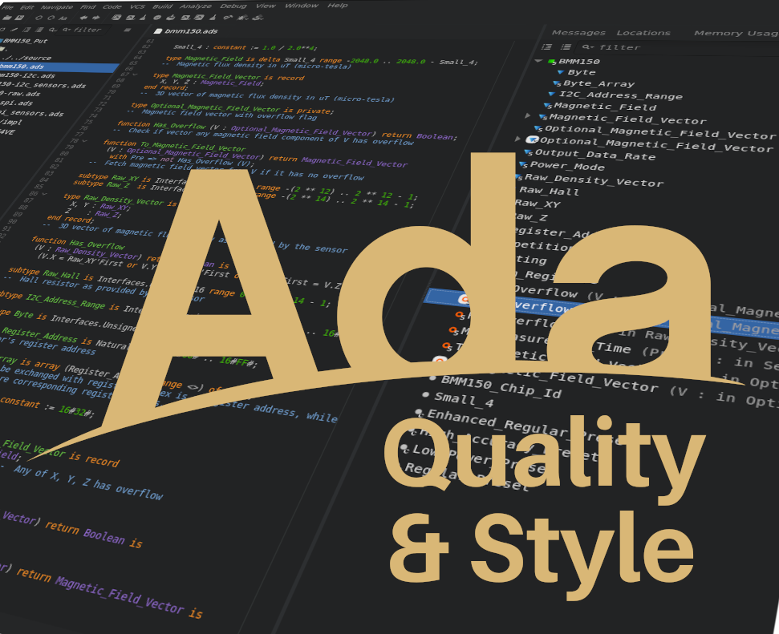

# Подкаст україньскою

Друзі, чудові новини! Google презентував неймовірний AI-сервіс,
який вміє перетворювати документи на якісні подкасти.
Тепер складні матеріали стають доступними для прослуховування будь-де
та будь-коли, а головне – сприймаються набагато легше! Мене настільки
вразила якість цих аудіоматеріалів, що я загорівся ідеєю створити
власну серію подкастів, присвячену чудовій мові програмування Ada.

І розпочнемо ми цю серію з огляду фундаментальної книги
["Ada Quality and Style Guide"](../../courses/style-guide-ukr/index).
Саме цей посібник свого часу допоміг
мені по-новому поглянути на Ada, розкрити її потенціал та усвідомити
важливість чистого та стильного коду. Впевнений, що наш майбутній
подкаст стане для вас таким же корисним і натхненним!

Перший випуск вже тут!

* [Spotify: Посібник з якості та стилю](https://open.spotify.com/episode/3ZGFjcuH6s6pRZv0YfQJkl)
* [Слухати MP3](https://ipfs.io/ipfs/QmbyC2wesEm5smyxjoV1QT5RqcWRDiWoanJYdn8Sg58hQ4/Introduction.mp3)
